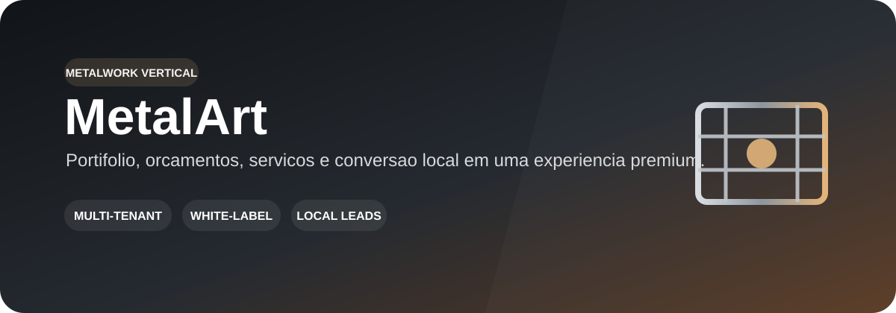
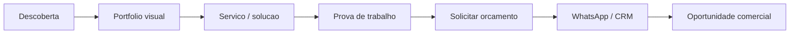

  

  
  
  

# MetalArt

Experiência digital premium para serralherias, metalwork e serviços sob medida, tratada como **vertical principal** do Tupiniquim Vertical SaaS. O objetivo é transformar o site e o portfólio comercial em uma plataforma configurável por tenant, preservando mídia real, identidade e conversão local.

## ✨ Visão do produto

| 🧱 Portfólio | 📐 Serviços sob medida | 💬 Orçamentos | 📍 Conversão local |
| --- | --- | --- | --- |
| Galeria de projetos, vídeos e provas visuais | Catálogo de serviços e aplicações por cliente | CTA para contato/orçamento com contexto | WhatsApp, localização, horários e presença local |

| 🎨 White-label | 🖼️ Media Manager | 🧩 CMS | 🔐 SaaS Core |
| --- | --- | --- | --- |
| Logo, paleta, tipografia e domínio por tenant | Mídias legítimas organizadas sem duplicar código | Serviços, páginas, seções e chamadas editáveis | Tenancy, RBAC, audit, entitlements e observabilidade compartilhados |

## 🧭 Jornada comercial

## 📄 Apresentação do projeto

A apresentação PDF é a referência documental do case e deve evoluir junto com este README, servindo como fonte para narrativa, diferenciais, screenshots e proposta de valor.

  <a href="docs/APRESENTACAO_PROJETO.pdf"><strong>📄 Abrir apresentação do projeto</strong></a>

## 🧩 Direção SaaS

No monorepo canônico, MetalArt é tratado como vertical principal. A migração deve preservar a experiência atual e mover personalização para configuração por tenant:

- identidade visual e mídia;
- serviços, portfólio e páginas;
- contatos, localização e CTAs;
- leads/orçamentos e integrações comerciais;
- módulos contratados e permissões administrativas.

## 🔐 Segurança e qualidade

- secrets fora do Git e do frontend;
- formulários públicos e uploads protegidos contra abuso;
- mídia e dados comerciais com escopo de tenant quando houver backend;
- autorização administrativa validada no servidor;
- logs sem dados pessoais, tokens ou stack traces sensíveis;
- auditoria e gates do Tupiniquim Toolbox permanecem obrigatórios.

## 📚 Documentação

- [Apresentação do projeto](docs/APRESENTACAO_PROJETO.pdf)
- [Auditoria Tupiniquim Toolbox](docs/TOOLBOX_AUDIT_2026-09-08.md)
- [Política de segurança](SECURITY.md)
- [Monorepo canônico — Sistema SaaS Geral](https://github.com/tupiniquimtechsolution-blip/Sistema-SaaS-Geral)

## 🚦 Estado real

O repositório de origem permanece preservado durante a consolidação SaaS. A equivalência visual e comercial deve ser validada antes de qualquer descontinuação do standalone. **Nenhum status production-ready deve ser assumido sem evidência de backend multi-tenant, autorização, testes, observabilidade e rollback.**
